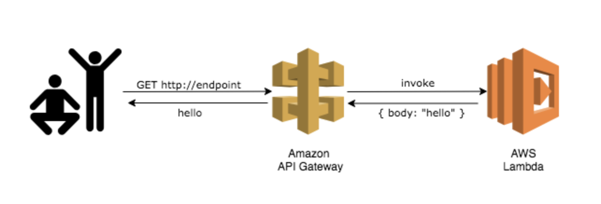
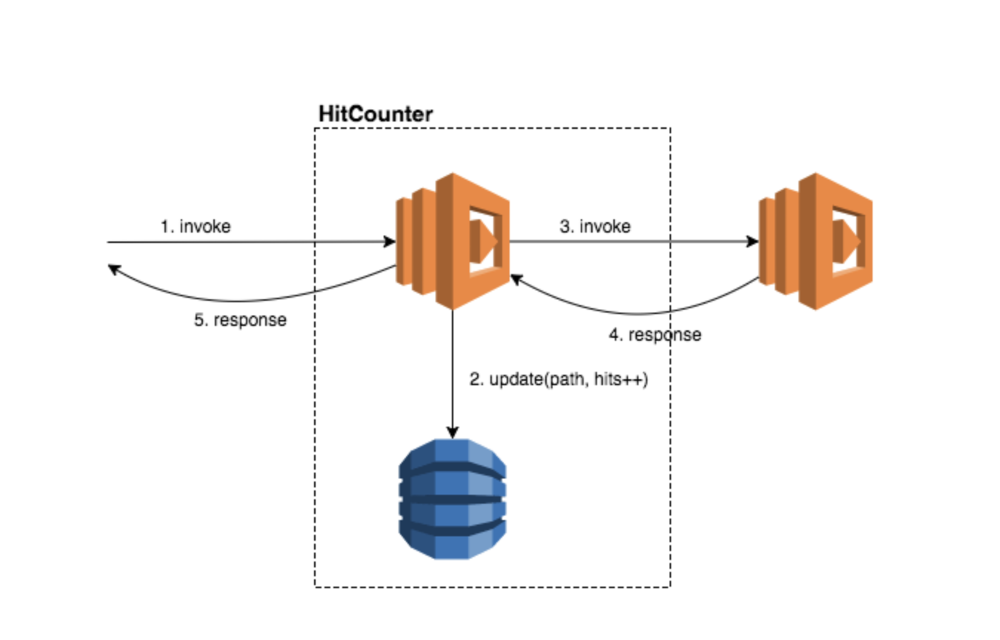
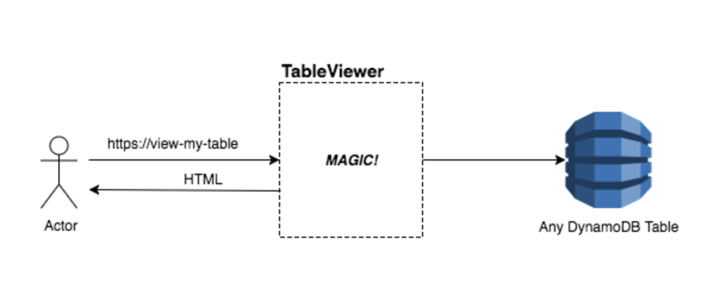

# Welcome to your CDK TypeScript project!

## Credits & DIY Workshop guidelines
https://cdkworkshop.com/

## Description
You should explore the contents of this project. It demonstrates a CDK app with an instance of a stack (`CdkWorkshopStack`)
which contains an Amazon SQS queue that is subscribed to an Amazon SNS topic.

The `cdk.json` file tells the CDK Toolkit how to execute your app.

## What we are trying to create

## Expectation from Custom Construct

## Using Custom Library for table viewing

## Useful cdk commands

 * `cdk deploy`      deploy this stack to your default AWS account/region
 * `cdk diff`        compare deployed stack with current state
 * `cdk synth`       emits the synthesized CloudFormation template

## Useful npm commands for code
 * `npm run build`   compile typescript to js
 * `npm run watch`   watch for changes and compile
 * `npm run test`    perform the jest unit tests
